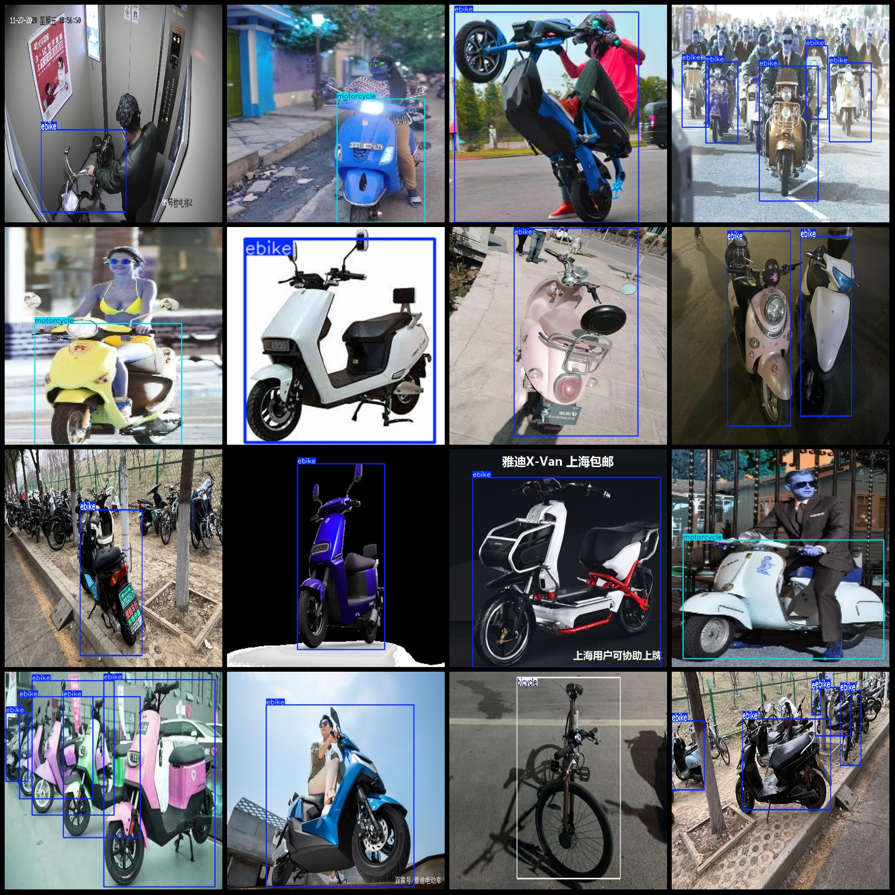
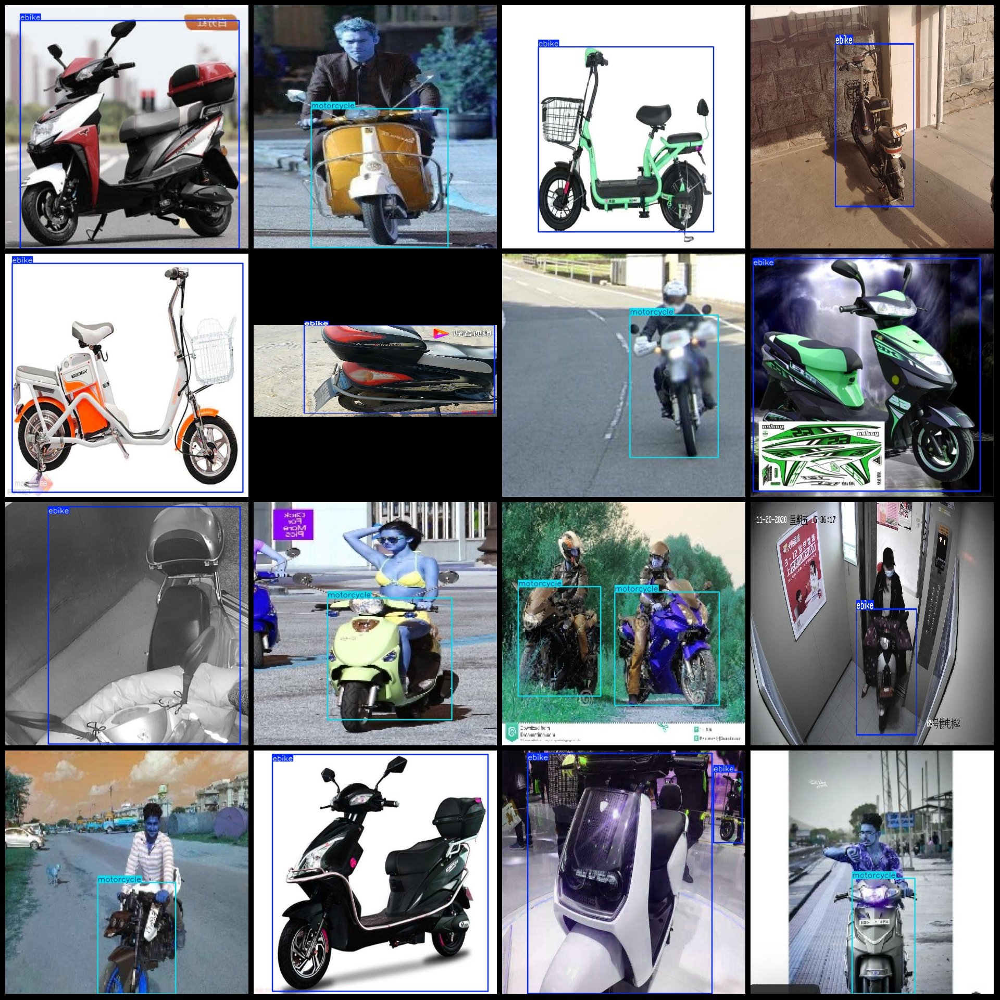

# Electric Vehicle, Motorcycle, Bicycle Detection Data Set - VOC + YOLO Format - 3453 Images in 4 Categories

The dataset format is Pascal VOC format + YOLO format (without split path in txtfile, only contain jpgimage and corresponding VOC format xmlfile and yolo format txtfile).
number of images: 3453  
annotation count: 3453  
annotation count: 3453  
annotationnumber of classes: 4  
Annotation class names (Note that the order of the Yolo format class is not consistent with this, and is based on the labels file's "classes.txt"): ["bicycle", "ebike", "electric-bicycle", "motorcycle"]
boxes per class:   
The number of bicycles in the box is 195.
Ebike (electric bike) box count = 3586
"electric-bicycle box count = 59" is a statement in English that translates to "The number of electric bicycles in the box is 59."
The box count of a motorcycle is 1703. This number represents the total number of motorcycles that have been shipped or sold in a given period of time. It can be used to track sales and inventory levels, as well as monitor trends over time.
total boxes: 5543  
images per class:   
bicycle images = 149  
ebike images = 2069  
electric-bicycle images = 45  
motorcycle images = 1288  
Image resolution refers to the number of pixels in a given image. For example, a 1920x1080 image has 1920 x 1080 pixels, while a 640x640 image has 640 x 640 pixels.
Use annotation tool: labelImg
Annotation rules: draw a rectangle box for class.
Important notes: The dataset does not have been divided into training, validation, and test sets; you need to divide them yourself.
Special statement: This dataset does not guarantee the accuracy of the trained model or weight file.
Preview image:
## Images

Here is a pay link on Stripe ( https://buy.stripe.com/3cs8yP7sY87d0vu9AB ). Please contact me lonlonago@foxmail.com after funding $89, and I will send you a complete data files , thank you!

